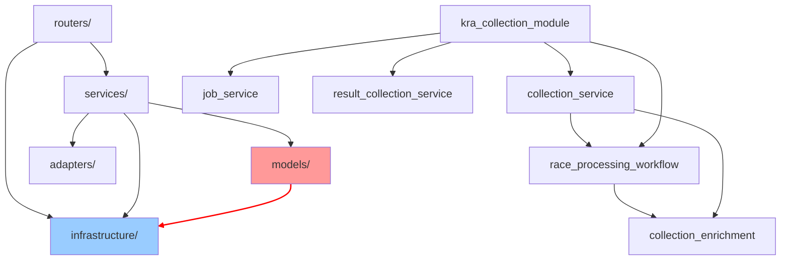

# 의존성 분석 보고서

> 생성일: 2026-04-08 | Phase 0 리팩토링 기반 자료

## 레이어 정의

```
routers/ → services/ → infrastructure/
              ↓              ↓
           models/        config.py
              ↑
          adapters/
```

## 발견된 위반 사항

### HIGH — 즉시 해결 필요

#### 1. models → infrastructure 역방향 의존
- `models/database_models.py:29` → `from infrastructure.database import Base`
- **영향**: 모델을 다른 곳에서 재사용할 때 DB 연결이 필요
- **해결**: Base를 독립 모듈(`models/base.py`)로 분리

#### 2. pipelines → services 의존
- `pipelines/stages.py:11-17` → `from services.kra_api_service import ...`
- `pipelines/stages.py:11-17` → `from services.race_processing_workflow import ...`
- `pipelines/data_pipeline.py:8-11` → `from services.kra_api_service import ...`
- **영향**: 파이프라인이 독립적이지 않음
- **해결**: Phase 1에서 pipelines/ 삭제 예정이므로 자동 해결

### MEDIUM — 서비스 분리 시 함께 해결

#### 3. services 간 직접 import 체인
```
kra_collection_module.py (파사드)
  → collection_service.py
  → job_service.py
  → kra_api_service.py
  → race_processing_workflow.py
  → result_collection_service.py

collection_service.py
  → race_processing_workflow.py
  → collection_enrichment.py
  → kra_api_service.py

race_processing_workflow.py
  → collection_enrichment.py (9개 헬퍼 함수 개별 import)
  → kra_api_service.py
```
- **영향**: 서비스 간 결합도 높음, 테스트 격리 어려움
- **해결**: Protocol 정의 + 의존성 주입

#### 4. routers → infrastructure 직접 의존
- `routers/metrics.py:8-9` → `from infrastructure.database import check_database_connection, get_db`
- **영향**: 라우터가 인프라에 직접 접근
- **해결**: health/metrics 서비스 추출 또는 runtime facade 활용

### LOW — 장기 개선

#### 5. collection_enrichment 높은 결합도
- `race_processing_workflow.py`가 `collection_enrichment`에서 9개 함수를 개별 import
- 각각 `_helper` suffix로 alias
- **영향**: enrichment 로직 변경 시 workflow도 수정 필요
- **해결**: enrichment를 독립 서비스 클래스로 추출

## 순환 의존성 현황



빨간 화살표: models → infrastructure (역방향 위반)

## 해결 우선순위

1. **Base 분리** (models → infrastructure 해결) — 변경 범위 작음, 효과 큼
2. **pipelines/ 삭제** — 미사용 코드 + 위반 동시 제거
3. **Protocol 정의** — services 간 결합도 감소의 전제
4. **race_processing_workflow 분리** — 가장 큰 God Object 해체
